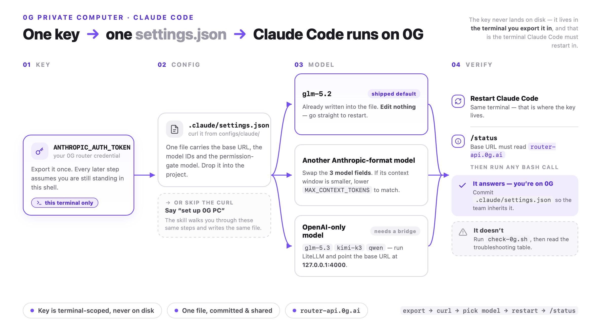
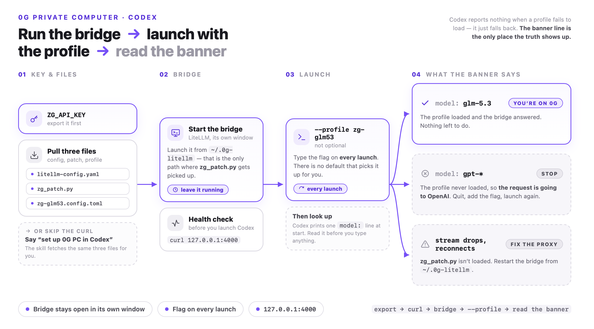

# 0G PC Skills

Ready-made configuration that points **Claude Code** and **Codex** at [0G Private Computer](https://pc.0g.ai) (`router-api.0g.ai`) — TEE-backed inference with OpenAI/Anthropic-compatible APIs.

Setup is: export your key, download a config file, restart. The config files live in [`configs/`](configs/) — they are ordinary files you can read, diff, and edit. Two Agent Skills ([`skills/`](skills/)) can walk you through the same steps in a session if you prefer that to reading this page.

Verified end-to-end on 2026-08-27 with Claude Code 2.1.246, Codex CLI 0.145.0 / 0.149.1, and LiteLLM 1.98.0.

## What you need

This repo configures clients you already have; it does not install them. You only need the row for the client you are setting up — the two setups are independent.

| Check | Needed for | If missing |
|---|---|---|
| `claude --version` | the Claude Code setup | `npm install -g @anthropic-ai/claude-code` |
| `codex --version` | the Codex setup | `npm install -g @openai/codex` |
| `uv --version` | the Codex setup — it is what runs the LiteLLM bridge | [docs.astral.sh/uv](https://docs.astral.sh/uv/), or use `pip` instead |

Plus a **0G PC inference API key** (`sk-…`) from [pc.0g.ai](https://pc.0g.ai) → Dashboard → API Keys. Do not put it in a file inside a repository, where one `git add -A` can commit it — the next section is where it goes instead.

## Your key never goes in a file

The config files carry **no credentials**. Your key lives in a shell environment variable and nothing else, which is why these files are safe to read, safe to diff, and safe to commit — a team can share one config in the repo, and each person brings their own key.

Three variable names, because three different programs read them — but only two of them carry your key:

| Variable | Read by | Value |
|---|---|---|
| `ANTHROPIC_AUTH_TOKEN` | Claude Code | your key |
| `ZG_API_KEY` | the LiteLLM bridge, on its way out to 0G | your key |
| `ZG_LITELLM_KEY` | Codex, talking to the bridge on your own machine | any string — the bridge does not authenticate |

The first two take the same key, so export both at once:

```bash
 export ZG_API_KEY='sk-…'
 export ANTHROPIC_AUTH_TOKEN="$ZG_API_KEY"
```

The leading space keeps them out of your shell history. They last as long as the terminal — a new terminal needs them again.

## What is and isn't touched

**Claude Code** — your global `~/.claude/settings.json` (hooks, plugins, status line, your `/model` choice) is never written. The config goes to `.claude/settings.json` in one project; deleting that file undoes everything.

**Codex** — Codex has no per-project configuration, so this cannot be confined to a folder. Your `~/.codex/config.toml` is never written; what gets added is one profile file plus a bridge directory, and it only applies when you launch with `--profile`. Existing Codex sessions are unaffected.

## Set up — Claude Code



### User workflow

Three steps. The third one is where it goes wrong.

```bash
# ① your key, in the terminal you are about to work in — skip if you exported it above
 export ANTHROPIC_AUTH_TOKEN='sk-…'

# ② the config, from inside the project you want on 0G
mkdir -p .claude && curl -fsSL https://raw.githubusercontent.com/0gfoundation/0g-pc-skills/main/configs/claude/settings.json -o .claude/settings.json

# ③ restart Claude Code — in that same terminal
claude
```

Then run `/status`: the Base URL should read `https://router-api.0g.ai`. That is the whole setup. The config arrives working, on `glm-5.2`, and the startup line `[claude-code:unrecognized_model]` is expected — Claude Code simply doesn't know 0G's model names.

**Step ③ is the one people miss.** Your key lives only in the shell you exported it in, so launching Claude Code from a different terminal returns a 401 that reads like a bad key. That is the cost of keeping credentials out of every file: every new terminal needs the export again.

### Then what

| You want | Do this |
|---|---|
| a different tier, without restarting | `/model` — Opus and Fable are `glm-5.2`, Sonnet and Haiku `0gm-1.0-35b-a3b`. **Never pick a "(1M context)" entry:** [it breaks every Bash, git and network call](#dont-pick-a-1m-context-entry). |
| a different main model | Edit three fields and restart — [which models qualify, and the context ceiling that travels with them](#switching-the-main-model). |
| `glm-5.3`, `kimi-k3`, `qwen3.8-max`, `minimax-m3`, `gpt-5.6-*`, `deepseek-v4-pro` | These speak OpenAI only and cannot reach Claude Code directly — [they need the LiteLLM bridge](#openai-only-models-need-the-bridge). |
| to confirm you are really on 0G | `curl -fsSL https://raw.githubusercontent.com/0gfoundation/0g-pc-skills/main/check-0g.sh \| sh` — it reads the effective model, the permission gate and the context ceiling, and says nothing when all three are right. |
| out | `rm .claude/settings.json` and restart. Nothing else to undo. |

If you plan to edit the file, [what it contains](#what-the-config-file-contains) is worth two minutes first.

## Set up — Codex



Codex cannot reach the 0G router directly — it speaks only the Responses API, which the router does not serve — so a local LiteLLM bridge translates. It listens on `http://127.0.0.1:4000`, which is the address the profile points at; if that port is already taken, change it in both places.

That bridge makes this the heavier of the two paths, and in two more ways besides: **every launch needs `--profile`**, and **Codex has no per-project configuration**, so unlike the Claude Code setup this cannot be kept inside one folder.

### User workflow

**Two terminals, and they stay two.** The bridge occupies one for as long as you use Codex on 0G; Codex itself runs in the other. Close the first and every session in the second stops working.

First, three files — either terminal, they land in your home directory:

```bash
mkdir -p ~/.0g-litellm && curl -fsSL https://raw.githubusercontent.com/0gfoundation/0g-pc-skills/main/configs/codex/litellm-config.yaml -o ~/.0g-litellm/litellm-config.yaml
curl -fsSL https://raw.githubusercontent.com/0gfoundation/0g-pc-skills/main/configs/codex/zg_patch.py -o ~/.0g-litellm/zg_patch.py
mkdir -p "${CODEX_HOME:-$HOME/.codex}" && curl -fsSL https://raw.githubusercontent.com/0gfoundation/0g-pc-skills/main/configs/codex/zg-glm53.config.toml -o "${CODEX_HOME:-$HOME/.codex}/zg-glm53.config.toml"
```

**Terminal 1 — the bridge.** Leave it running; the first launch takes a minute or two to install dependencies.

```bash
 export ZG_API_KEY='sk-…'          # your real key — the bridge is what authenticates to 0G
cd ~/.0g-litellm && uvx --from 'litellm[proxy]==1.98.0' litellm --config litellm-config.yaml --port 4000
```

**Terminal 2 — Codex.** This is where you work.

```bash
 export ZG_LITELLM_KEY='sk-anything'    # literal, not a placeholder — the bridge does not authenticate
codex --profile zg-glm53
```

**The two exports are not interchangeable, and neither one travels.** `ZG_API_KEY` carries your real key from Terminal 1 out to 0G; `ZG_LITELLM_KEY` is what Codex hands the bridge on your own machine, which does not check it — `sk-anything` is the literal value, copy it as is. Put either in the wrong terminal and it does nothing at all: the bridge fails to authenticate, or Codex does. And both are ordinary shell variables, so a fresh Terminal 1 tomorrow needs its export again.

Then, every launch, read the `model:` line in the startup banner: your configured model means the profile loaded, `gpt-*` means it was not found and the request went to `api.openai.com` instead ([why that is silent](#codex)).

### Then what

| You want | Do this |
|---|---|
| a different model | Run the skill again for it — it writes another `zg-<name>.config.toml` alongside the first. Both stay; `--profile` picks between them. |
| your ordinary Codex back | Launch without `--profile`. Nothing to undo, nothing to restart. |
| to work out what went wrong | Read the `model:` line first — it catches the common case. Then check that Terminal 1 is still up. |
| out | `rm "${CODEX_HOME:-$HOME/.codex}"/zg-glm53.config.toml && rm -rf ~/.0g-litellm`, and Ctrl-C the bridge. |

## Using the skills instead

If you would rather be walked through it, install either skill and ask for it by name. They perform the same steps and explain what each one does.

```bash
mkdir -p ~/.claude/skills/0g-pc-model-config-claude && curl -fsSL \
  https://raw.githubusercontent.com/0gfoundation/0g-pc-skills/main/skills/0g-pc-model-config-claude/SKILL.md \
  -o ~/.claude/skills/0g-pc-model-config-claude/SKILL.md

mkdir -p ~/.codex/skills/0g-pc-model-config-codex && curl -fsSL \
  https://raw.githubusercontent.com/0gfoundation/0g-pc-skills/main/skills/0g-pc-model-config-codex/SKILL.md \
  -o ~/.codex/skills/0g-pc-model-config-codex/SKILL.md
```

Then say **“set up 0G PC” / “接入 0G PC”** (Claude Code) or **“set up 0G PC in Codex” / “在 Codex 接入 0G PC”**.

**Update:** re-run the curl. **Uninstall:** `rm -rf` the skill directory.

## After it's configured

### Claude Code

Config is read at launch, so nothing changes in a session that was already open. Close it, open a new terminal in the same project, run `claude`, and check `/status` — the Base URL should read `https://router-api.0g.ai`.

#### What the config file contains

`.claude/settings.json`, in the project:

```json
{
  "env": {
    "ANTHROPIC_BASE_URL": "https://router-api.0g.ai",
    "ANTHROPIC_API_KEY": "",                 // blanked so your exported token is the one used
    "ANTHROPIC_MODEL": "glm-5.2",            // the main model
    "ANTHROPIC_DEFAULT_FABLE_MODEL": "glm-5.2",
    "ANTHROPIC_DEFAULT_OPUS_MODEL": "glm-5.2",
    "ANTHROPIC_DEFAULT_HAIKU_MODEL": "0gm-1.0-35b-a3b",
    "CLAUDE_CODE_MAX_CONTEXT_TOKENS": "983616"
  },
  "modelOverrides": { "claude-sonnet-5": "0gm-1.0-35b-a3b" },
  "permissions": { "defaultMode": "acceptEdits" }
}
```

Every tier points at a 0G model, so whichever one Claude Code reaches for, the request stays on 0G. No credential appears anywhere in the file — that comes from `ANTHROPIC_AUTH_TOKEN` in your shell.

This is the project settings file, meant to be committed. If you also keep a personal `.claude/settings.local.json`, that one wins — Claude Code loads `local` after `project` — so a setting that seems not to apply is worth checking there first.

#### Switching the main model

Edit `.claude/settings.json` and restart. Three fields move together:

```json
"ANTHROPIC_MODEL": "deepseek-v4-flash",
"ANTHROPIC_DEFAULT_FABLE_MODEL": "deepseek-v4-flash",
"ANTHROPIC_DEFAULT_OPUS_MODEL": "deepseek-v4-flash",
```

Leave `ANTHROPIC_DEFAULT_HAIKU_MODEL` and `modelOverrides.claude-sonnet-5` alone. The second one is the permission gate: point it at a reasoning model and every Bash, git and network call starts timing out under auto mode.

These eight models speak the Anthropic API and can be swapped in by editing alone:

| Model | Context | `CLAUDE_CODE_MAX_CONTEXT_TOKENS` |
|---|---|---|
| `glm-5.2` | 1048576 | `983616` (unchanged) |
| `claude-fable-5` | 1000000 | `983616` |
| `claude-opus-5` | 1000000 | `983616` |
| `claude-opus-4-8` | 1000000 | `983616` |
| `claude-sonnet-5` | 1000000 | `983616` |
| `deepseek-v4-flash` | 1000000 | `983616` |
| `0gm-1.0-35b-a3b` | 262144 | **`245760`** |
| `glm-5` | 202752 | **`190080`** |

> The last two rows are the trap. `CLAUDE_CODE_MAX_CONTEXT_TOKENS` ships as `983616`, which is far above what those models accept — leave it and the session fails on context length only once it grows long, by which point the model switch is the last thing you'd suspect. Lower it in the same edit.

Or run [`check-0g.sh`](check-0g.sh) after any change — it reads the effective model, the gate and the ceiling, and says nothing when everything is fine:

```bash
curl -fsSL https://raw.githubusercontent.com/0gfoundation/0g-pc-skills/main/check-0g.sh | sh
```

Check the current list yourself with `curl -s https://router-api.0g.ai/v1/models`; anything whose `supported_formats` contains `anthropic` belongs in the table above. And whichever model you pick, don't append `[1m]` to its name — same failure as below.

#### Don't pick a "(1M context)" entry

`/model` moves between the tiers above with no restart. What it must not move to is a "(1M context)" variant. Claude Code derives the auto-mode safety classifier from the Sonnet tier and copies your main model's `[1m]` tag onto the result, asking the router for `0gm-1.0-35b-a3b[1m]` — an ID it does not serve. The classifier becomes unreachable and auto mode fails closed on every Bash, git and network call, while chat keeps working, so it reads like the model is fine and the tools are broken.

Your `/model` choice is remembered in `~/.claude/settings.json`, so this survives restarts and follows you into other projects. The skill will then refuse to write a new config until you clear it — that refusal is the guard working, not a bug. Fix it with `/model` and a plain (non-1M) entry.

#### OpenAI-only models need the bridge

`glm-5.3`, `kimi-k3`, `qwen3.8-max`, `minimax-m3`, `gpt-5.6-*` and `deepseek-v4-pro` cannot reach Claude Code directly. They need the same local LiteLLM proxy the Codex setup uses — install the two bridge files and start it in its own terminal:

```bash
mkdir -p ~/.0g-litellm
curl -fsSL https://raw.githubusercontent.com/0gfoundation/0g-pc-skills/main/configs/codex/litellm-config.yaml -o ~/.0g-litellm/litellm-config.yaml
curl -fsSL https://raw.githubusercontent.com/0gfoundation/0g-pc-skills/main/configs/codex/zg_patch.py -o ~/.0g-litellm/zg_patch.py
cd ~/.0g-litellm && export ZG_API_KEY="$ANTHROPIC_AUTH_TOKEN"
uvx --from 'litellm[proxy]==1.98.0' litellm --config litellm-config.yaml --port 4000
```

Then two changes in `.claude/settings.json`: `ANTHROPIC_BASE_URL` to `http://127.0.0.1:4000`, and the three model fields to the model you want. The proxy does not authenticate, so in this mode `ANTHROPIC_AUTH_TOKEN` can be any string — the real key is the one `ZG_API_KEY` carries into the proxy. Or say "switch to glm-5.3" to the skill and let it do all of it.

#### Going back to Anthropic

`rm .claude/settings.json` and restart. Nothing else to undo.

### Codex

**Every launch needs the flag**, `codex exec` included. No restart, though — there is no session to restart.

```bash
codex --profile zg-glm53
codex exec --profile zg-glm53 "…"
```

**Keep the bridge running.** Codex speaks only the Responses API, which the 0G router does not serve, so a local LiteLLM proxy translates. It lives in its own terminal and must stay up for the whole session:

```bash
cd ~/.0g-litellm && export ZG_API_KEY='sk-…'
uvx --from 'litellm[proxy]==1.98.0' litellm --config litellm-config.yaml --port 4000
```

**Check the `model:` line in the startup banner, every time.**

| `model:` shows | Meaning |
|---|---|
| your configured model, e.g. `glm-5.3` | The profile loaded; requests go through the bridge. |
| `gpt-*` | **Stop.** The profile was not found and Codex fell back to its own default — your request is going to `api.openai.com`. Codex reports nothing when a profile is missing, so this line is the only warning you get. |

**Switching models** — each run of the skill writes another `~/.codex/zg-<name>.config.toml`. They all stay; `--profile` picks between them.

## Verifying a change

If you are changing this repo rather than using it, [`verification/`](verification/) holds the two manual protocols — one per client — that check a config end to end on a real machine: what to run, what each step should print, and how to read the failure modes. They exist because the interesting failures here (a poisoned classifier, a silently redirected Codex request) look like something other than what they are.

## Live model list

Worth checking before picking a model, since the tables above age:

```bash
curl -s https://router-api.0g.ai/v1/models
```
